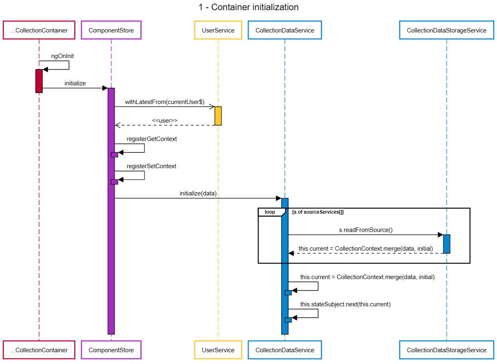
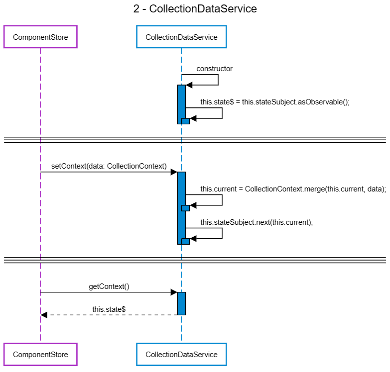
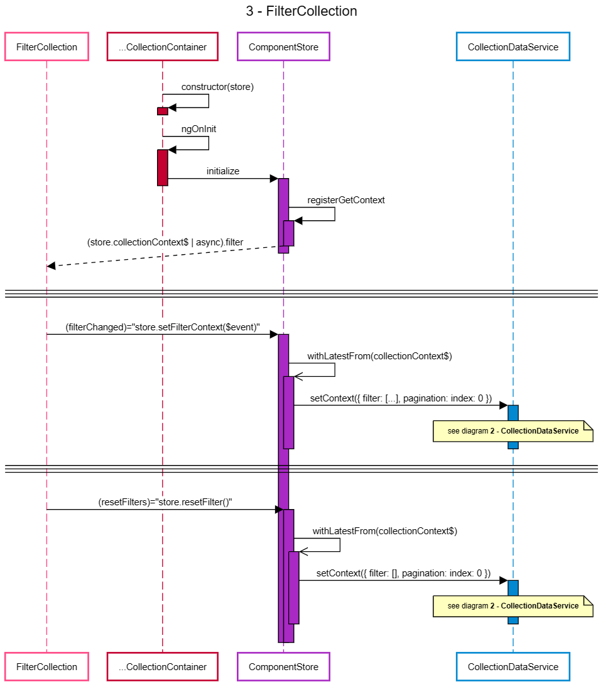
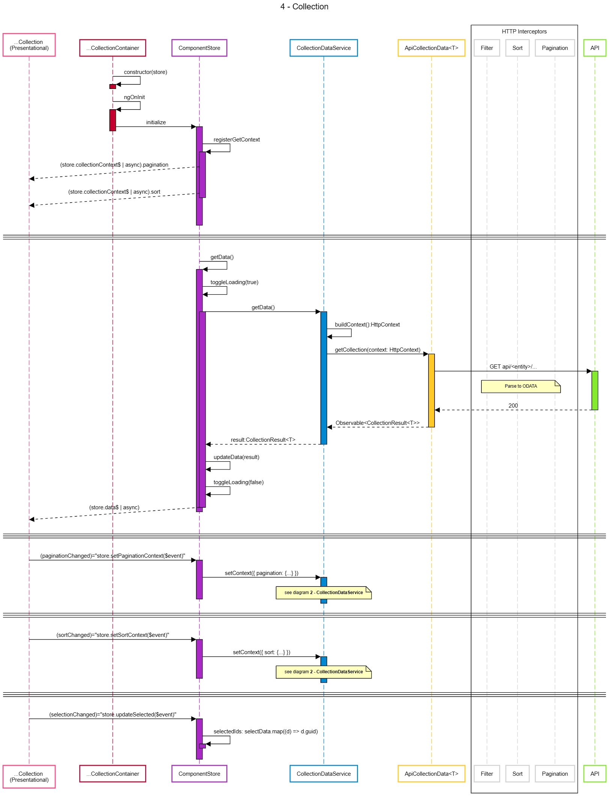

# Collection
## Overview
Designed to display a collection of a representation of an entity, that allows bulk actions and filtering on that collection.
This template is not particularly bound to any specific entity representation and can be used to host multiple ones as long as they support bulk 
actions and filtering as well.

[badge-error]: https://github.com/Mqxx/GitHub-Markdown/blob/main/blockquotes/badge/error.svg 'DON´T'
> ![badge-error][badge-error] 
> Create a list container component for each collection representation of an entity

[badge-check]: https://github.com/Mqxx/GitHub-Markdown/blob/main/blockquotes/badge/check.svg 'DO'
> ![badge-check][badge-check] 
> Create a single list container component that contains a switcher that can toggle between each collection representation

## Concept
### Dataflow
<table border="0">
 <tr>
    <td>
        
        

            <a target="_blank" href="https://sequencediagram.org/index.html?presentationMode=readOnly#initialData=C4S2BsFMAIEZoLTQMIHsB2wCGJ2QE7S5ghbggBeWoGAULQEarDCoC2ADlvqAMYhdMAZ1pceIfoODQAxMgDMABkUAmAGLQARADpdacFF410aTDjz5N0LEOgBxI-lPZcBUdz4CsmWVgAcKgCcvPIAXPCaaJwYkJgAyqz4kFY2KBguFgmoSe7ikt7SMmpqyACCKn5aAKpCBHEEAG4Syda2AJLoTdjGzpAAHsD1+E28kLmeUrKqfn4AIvD6hsaz1FhDI2NiEwVTFXMLqAaQRiAYK9hZ+FgA5pDrzfTkAGaQ5HhCwACeUPaOzuYEWQKZTqcKhAAmNgAFpBwbQsCcGsdDtlfsAnOkAYQ5EpVGpHiAXm9IB9vjB-q58JcYDJ-EEQmDIUIYXCEaAkbwUYQKZlEjS6cF5ASia5ST8Ol1qKcTOl+oNGs1ZMUyhVGdDYfDEcjwKiJWApRhegN7qMlSVyn5ha9RV8fotjstViaadN9mrmRq2SAOVy0kcTmcnQrTTJXfMrcSxeTDktpec1okbndgy69vN3SzNeztaj7QH0PHLknnbsZuH4QBXVhehoG9DQOi0BzonkEBAAPmbGLMlNC6GuAHl0B0wPQu638B2J9TQsRQGRKGNwZAa9QV09gIDx5jKfRp3yO+29d1pUb5cNmqEAO5gKEAGTXHzU+HYAApeBX8ElMDUCAASABKWhjzrM9nQQQ992ySBQgAHlgitanwdt21oKCkinHdeWg0IkmuEAPgIOxIGAM96GXVdNywDdAXQsY6MwntsKSXDIHwwiqRIsiKMRNdqM3bksLqPk0KEqkD3bPNHQuFNZ3QEgFwoSBX0hbAgNoHVUA4aBbFQJ4dNQT9RmdIQAG0AF09xjB04yDC9Rkw-1pITbJi1koRtCSLBwWfdg4kM-BRlfdTRKc2yLkTW5wMc2NAxk+yYOAKECO0D8v1iaQAF4-VimVMDlbQ2AIW4VNWAAaIh5PncB1NiOFQtywsUximy4rWWSkpStLvyynLWryzcBkK4rlNUrAKrnUgatoHj2T4mjBLCtrnQa-qmoSlr83WjZQk6jyPjXOIKwYAArB1tDwAZXz21LPx6oDZu9eaBL6ra7I2eggA">SOURCE</a>
        

    </td>
    <td>
        
            

                <a target="_blank" href="https://sequencediagram.org/index.html?presentationMode=readOnly#initialData=C4S2BsFMAICZoLTQMIHtxQMalQOwCICGwhAypAE4BuImkAUPQEarDCoC2ADoRaJiB65gAZ3o8+tQYWHQAxIQAcsAJyYAzCk5c8kYaXYUGE-tNlyADLEWL8ARi0ZI2EHiIly1Wg3rgQAM0g-XEgRYABPKC1uXX1DGAVlNXUALjsUgBNCEQALSAz6QhcqZ3RUCmidELjyhKVVDUY-QODQiKi0Jxc3YjJKGjp5Kxt7NMzsvIKi0BLMMorOrBwCXs8BhOHbO0ZCAFd2aZAqYldcaDxGRedl9z6vOgQAPivulY9+7xToOdwwil3sOV6C8bqsPg9nuglqdbmtPsAciARAA6MLESAAEmgAF5oAikaiSMBIKRdkwAFbXZHZADyTBE-UITCgAAoAJQAbnoGUgh2OxMI-mJCyh1xhYPuDB5fPRguFjmhPXeksY2LV2Mu2liwAMtSeIPFyvWKQZwDQwkgAA9gCysiQvga8Obida2cDRa9YeDIPqPaCjfDESjMLsKEZZLjHbhnVbgMiOJQAOaQFn44Oh8PAAA00DthE53N5xVlQsoCrFSru63dXX9Ve8vtrhvrdBSacJ6NJFKpIWtqaDyJDYb0wAL0uLAtLIqblbhdELMsn8qjXpV9HVGvdMWqOvijcVbxbkBSybNeBdNrdK4l6wQvu3I91Ri+7bRxIxQA">SOURCE</a>
        

    </td>
 </tr>
 <tr>
    <td>
        
            

                <a target="_blank" href="https://sequencediagram.org/index.html?presentationMode=readOnly#initialData=C4S2BsFMAIGZoLTQGInMSAnAwge3FAMai4B2AUOQEa7DC4C2ADgIaaiEiunADO5rdiE7dg0AMTJkAFgDsADgCs0AESp0WPAUjEQZFdBa9oAcWKZ1GHPiIkKgjlxY8J2WAAZ3AJmSqAdAFatnqkeDwsIKRYBkam5mHAEVGYAmyOohIs8l4AnISwAFwAjNB4zGSQPADK9JiQqUIizmLi3vLyACIlQTp2HSyJVVgAbsL15OAgAGaQk1G8wACeUHHAFmhWPbpkElJySsUFACZGABaQR+QsusM6+LiYq+sa1trbpLsyCoqUkzNzkAWyxgZjWCSSWFcHm8yEOJ1450u11At0I90eoOs4UikPEbk8Pl+01mOKBKzKTAq1VqMHEWVy+ThZwuVxud3AD1KjEpUWpD1p9LysCJ-1JS3JNl6IX6gxGYwkbU6RSZCJZyJAqPRXLefQGLCGmFGhFpiq6lBYAFd6OrhgMQtAyJRMeCcZgEAA+Z1kRKugpo0gLTAW4gPAAUC35AEpyEdIDaBnGplYni7kk74t6IW7PRnsckCqQAOYAeVIAElSGB02DM66PRSqcAavyCpEwCAWJMAF71WPxjAsJOQr15rCUcgN3lNmn17mN5t1Ap1QsgBZYEyQYAJSAAD2AlEnlWn-IQHtDXkjmMsmkl7wK4ZpfjROpC273ABJoAAfQy8RakQhIz8KYNjHPsbgTQdk0PPk6koABeRD4OrZ5NlvOxZ3KKcF0ge8QJebBTmcQsLkjeCVAjOo-F4TdryxDA91Dd9IFuHhIxUCc52wmd3XdGDj0XAB3MBTgAGQTBZkEwRhQ2fYIyDfYB32jficNnF8yBlfU5WNAoaK3b1d2AUMAG9oHwqwCmgABtAI-AAXQAGmgVgV1IO0yCsyJYx3Kz3GgABfaNSFoGBcFuR4tl1WVDTGSQpGQbB3Cs08aJgI4O0LTAWAYaAACo8q8RBtXk0gtINI1IAK08YzjCCByHSL0OlPUKrGWr+0TaCuKPHCEKQlC6KikJMJ5XqaXvOp9Lo3gyIox8pto0DMFDdjOKw8aT141SJuE4AxIk4ApJkuSpQUwyPxUnrYMgdTSvKnTcP0xTTPM5arOspyXJYNyPNILzSB8vzAuC0KHQikqzrK1rHviqQkpShA0ugDKfuy3KCqKpBhs0mHYuNaqEA6+qushHHoZiyriZRSDGq5DabvIIA">SOURCE</a>
        

    </td>
    <td>
        
            

                <a target="_blank" href="https://sequencediagram.org/index.html?presentationMode=readOnly#initialData=C4S2BsFMAIBZoLTQMIHtxQMalQOwFD4BGqwwqAtgA4CGATqJiLbsAM760MhMvDQBiAGJDYAdgAcAVmgAiAHSK0GSNhB5oAHVwAKAAp1IbSKxo5cNcAEpZ0Gm2gBxbHWVZzneo2Y1Wg5ADMAAxBAExCcorybqrmaKYguJB0tvZOLvHANInJnty8vvwCNBKhAJyYASiUVHgmwADK5IZ53nyCYRISACIAjNUqanjdZjQNyQBuPJCtPD5+wkLIAIKhEnLLVCAxQ7gjWQA8ACoAfKkOm9vo7up7o7MFrADmdKgArlTQABJHR3rQAElWMlMJAqM0OFw2oVBOAQE8ABbAF40ACe0CEIHAwFyULm7QEcMRyLoaOgDVQDAe8yKRKRKPRehoT0SZlu+BMABNqQTpABRVbdaDLPQAwhwgBmkDhSTYwFRUHSwFc11it0EInE0gAXL1tZz7AjINyaGoJqp0JSlSrBuYNaJJFJxSApTKjPLFc5lZlskk6P5gmEhLr9YbjfhTaBzZhLf6vSqEn6AyFws7XTk5QqYGhqHVWE1KTBiqUKgEQwa2EaTWaLeArTnakl880iyVypU09KMx7s6rdvsxpNph01j09XqK1WIzWY3X-TtzAPxnQpqCR10+p23ZnFZcF7cB-aVmty2Hq1Ha1a933F6Mj6sJFvu1mMVicf7CfD6aTUafK+HJS7WUe3JSlaS-Ek0T-KdAO3ECmRZCw7U-YkGWg8N8Fg59d1FQR+UFdDzxAaNY2FXCBHw0JukIeMfRyOgEBOWi8CyejtRjXA5ToN5sEpHQ5ULKxpyjMwYGYxNck5SBI2I0SaAld9rTov0aIyFjfWSRjxNYv1tVwJ4AHlcCBMBhNknElPU+jVO9Ky-UYhs80aFttUSMAQEsEAAC8ZikmSJjkhTkksiS6EIfzROqXMm2cwt8EcmKC0MByaicpLIG1QwWTlZJHEgYBMkgAAPYAzICiyEvqdLCEq5tCwQRidFCKxmNtW5tX4lt5FnG48EKkqABJoAAHzsNhUVwTArHkWhELZPB4tSxKWwak4mpatS2rwDqBMMbqb1ufrgCG0b7Amqb5DYMD8D8s1AsU2rYpaNhaFBG7pLunF5IepaqpbQh8AAXmBwGAcW6K-vqk5HvS7UnnygcdCEiKKt+uqWnBxtIeS6G0aejLyCeJ4oAAGVQGhOUSJ4dGVN5ICEmq8fSlKtruLJl1XDL4eARHkc+3sIfRmYUd7VmlyHN7FrF0YOemFnerZwcV2mbUiDeLFOSOpHtS+MgqCOxnpfZiXIEY68jZoOH8v3PAdA4nESu1b49aOvmRIs82FYHAHPbVYZRjN0VtUcPkjjsLYAHoDnqMBUROCOojKyKRTFfBcFIGBUHNf1MWxZIABoENZcxFhEZAgm1BqmToYxoHIaADO6ZYjmWBrCBT1bff7UYndCEJ3pFsjU6728slWm3Fdl0FtQMohjBXGgiCgA4J4AJSMN5sWOE4TgH-nhS2Cfvalr2ZZN8emZcww2E34BtTXjet9OPf3dF0-jeVyWYZW3HBfx7UPgGhxIja+t8GbfyhhAww2pCbE0gGTCmVMdASksMYcBl96qNWaq1BWO0upAJoCdMa50GYv3MgLLGQsyHlWkkFecGCMYg1BhGN45AUbqgWvgHBftcApT-rDHQs1i6HQRL4eGnIrCA1kLtSAl18pFyQodFixVgA6AGpAc0rAbCYzSj-I+Z9P4ZWMAVZRJUdAAG9oBCMUdtaA5iogAF9oAOKEunCyWdgr6I-pzUuSwK6IAQMYGAlNmSkgoNAAAVBE0IiABjvyVpzKJbdbqv2+p4g6-tvHTGoZFKBMwgYgxsjaBWfDKH-34mBZAoj9LGkkdIrqxiKQMC1uozRwBtF5Pljw8WhjtTGK1pYq6DAnb2MUE4lxacM7QA8fQi2U9IC+PLk7BqQToAhJROEqJMSkBeISdMJJCAclfToXE7pBjOZHIobouKBTgZFInqU650D+LSh4VUsRtSpEyPkIA0S4x3DGjURo+oHSGGm1-mU2GxgAWcgBJyNgTtoWxAHPICgNAqA6B0BI6AgMThrPkE8dWEjLlpPofwlsQA">SOURCE</a>
        

    </td>
 </tr>
</table>

### ComponentStore
Currently, our implementation uses the concept of [ComponentStore](https://ngrx.io/guide/component-store).
The reasoning behind this choice was that this would be an intermediate step toward a full global Store shared across the entire application, 
however in order to manage the complexity of this transition in the whole code base, ComponentStore offers a nice middle ground while 
increasing the team’s know-how in reactive component coding style.

In the future once all UIs were migrated to ComponentStore, we can easily introduce the global Store with very little code change and no 
paradigm change making the transition way smoother

### Marble testing
Our store is completely *Observables* based, thus there is two main test patterns that can be used: **subscribe and assert** and **marbles** ([more on those patterns](https://medium.com/angular-in-depth/how-to-test-observables-a00038c7faad)).

In our case we are using [marble testing](https://rxjs.dev/guide/testing/marble-testing) strategy to not only be able to test asynchronous code but also in order to align with industry standards 
and to drive more a deeper understanding of Observables.

All the test is done without any external library, relying solely on `TestScheduler` from `rxjs/testing`.

## Implementation
### Naming convention
All components created using this template should have the following name convention:
> **\<entity\>**-collection-container

Where **\<entity\>** is a business entity/concept that have a visual representation
### Dependencies
#### Libraries
#### Modules
### Structure
### Files
#### *.module.ts
#### *.component.html
#### *.component.ts
#### *.component.stories.ts
#### *.store.ts
##### Standards
#### *.store.spec.ts